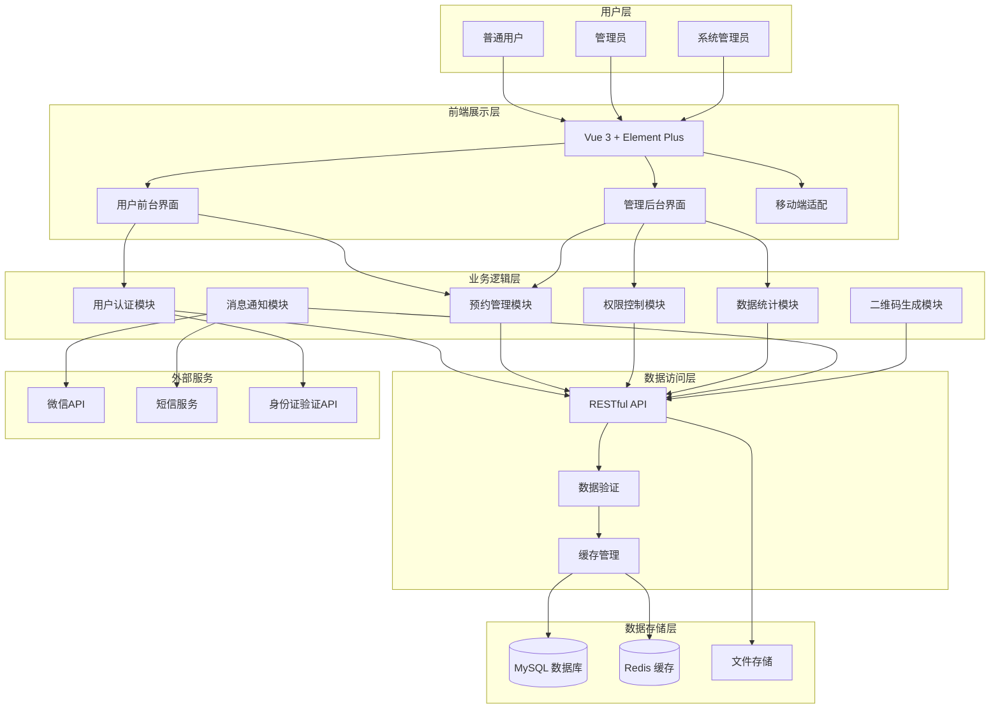
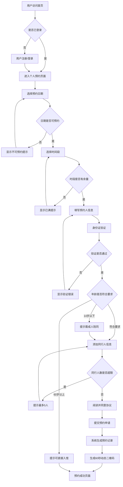
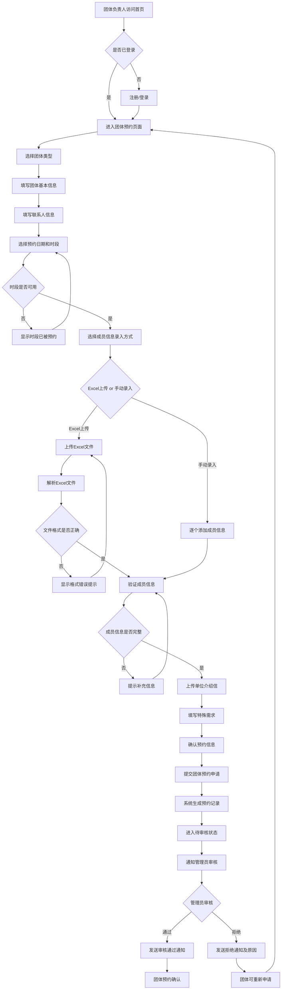
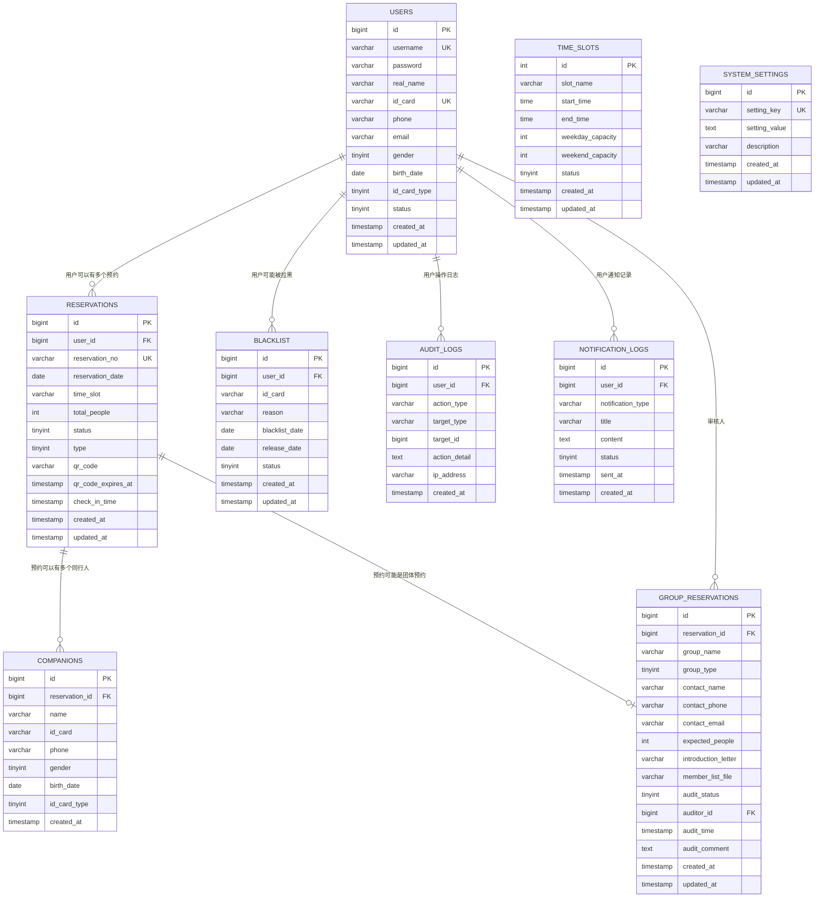

# 中国（哈尔滨）森林博物馆预约系统详细开发文档

## 📋 项目概述

### 项目背景
中国（哈尔滨）森林博物馆需要建立一套现代化的预约管理系统，以规范参观秩序、提升服务质量、优化参观体验。本项目将基于现有的Vue 3 + Element Plus技术栈，将停车场管理系统改造为专业的博物馆预约系统。

### 项目目标
- **业务转型**：从车辆管理转向参观预约管理
- **用户体验提升**：提供便民的前台预约界面和完善的个人中心功能
- **管理效率优化**：建立智能化的预约管理和黑名单管理机制
- **数据分析能力**：提供全面的预约数据统计和可视化分析

### 技术栈
- **前端**：Vue 3.2.14 + Element Plus 1.1.0 + Vue Router 4 + Vuex 4
- **构建工具**：Vue CLI 4.5.0
- **样式**：Sass + Element Plus组件库
- **工具库**：Axios、ECharts、QRCode.js、xlsx

## 🏗️ 系统架构设计

### 整体架构
```
┌─────────────────┐    ┌─────────────────┐    ┌─────────────────┐
│   前端展示层     │    │   业务逻辑层     │    │   数据存储层     │
│                │    │                │    │                │
│ Vue 3 + Element │◄──►│  RESTful API   │◄──►│   MySQL 数据库   │
│ Plus 组件库     │    │   Spring Boot  │    │   Redis 缓存    │
│                │    │                │    │                │
└─────────────────┘    └─────────────────┘    └─────────────────┘
```

### 模块划分
1. **用户前台模块**
   - 首页展示
   - 个人预约
   - 团体预约
   - 个人中心

2. **管理后台模块**
   - 预约管理
   - 用户管理
   - 数据统计
   - 系统设置

3. **公共模块**
   - 身份验证
   - 权限控制
   - 二维码生成
   - 消息通知

## 📱 功能模块详细设计

### 1. 首页展示模块

#### 功能描述
博物馆主页面，展示基本信息和功能入口

#### 页面组件
- **MuseumHome.vue** - 首页主组件
- **MuseumInfo.vue** - 博物馆信息展示
- **NavigationMenu.vue** - 导航菜单
- **VisitGuide.vue** - 参观须知

#### 核心功能
- 博物馆背景图片展示（森林主题）
- 开闭馆时间信息（周二至周六9:00-15:30）
- 基本信息展示（地址、电话、交通指引）
- 功能入口导航（个人预约、团体预约、个人中心）
- 参观须知信息（入馆规定、注意事项、安全须知）

#### 技术实现要点
```javascript
// 开馆状态判断
const isOpenToday = computed(() => {
  const today = new Date().getDay();
  // 周二(2)到周六(6)开放，周日(0)周一(1)闭馆
  return today >= 2 && today <= 6;
});

// 当前时间是否在开馆时间内
const isOpenNow = computed(() => {
  const now = new Date();
  const hour = now.getHours();
  const minute = now.getMinutes();
  const currentTime = hour * 60 + minute;
  return currentTime >= 540 && currentTime <= 930; // 9:00-15:30
});
```

### 2. 个人预约模块

#### 功能描述
提供个人用户的预约功能，支持实名认证、同行人管理、时段选择等

#### 页面组件
- **PersonalReservation.vue** - 个人预约主页面
- **ReservationCalendar.vue** - 预约日历组件
- **VisitorForm.vue** - 访客信息表单
- **TimeSlotSelector.vue** - 时段选择器
- **CompanionManager.vue** - 同行人管理
- **QRCodeDisplay.vue** - 二维码显示

#### 核心功能
- **实名认证**：支持身份证、护照、港澳通行证、外国人永久居留证
- **身份验证**：自动识别身份证位数，验证格式，计算年龄
- **年龄限制**：14周岁以下不可单独预约，60周岁以上免预约
- **同行人管理**：一人最多预约5人，需填写完整身份信息
- **时段选择**：6个时段可选，显示剩余名额
- **二维码生成**：预约成功后生成60秒有效的动态二维码

#### 预约规则
- 每周二9:00放本周四五六的号
- 周四五：每时段100人，总计600人
- 周六：9点13点100人/时段，其他150人/时段，总计800人
- 累计2次逾期未取消将被拉黑60天

#### 技术实现要点
```javascript
// 身份证验证
const validateIdCard = (idCard) => {
  const reg18 = /^[1-9]\d{5}(18|19|20)\d{2}((0[1-9])|(1[0-2]))(([0-2][1-9])|10|20|30|31)\d{3}[0-9Xx]$/;
  const reg15 = /^[1-9]\d{5}\d{2}((0[1-9])|(1[0-2]))(([0-2][1-9])|10|20|30|31)\d{3}$/;
  return reg18.test(idCard) || reg15.test(idCard);
};

// 年龄计算
const calculateAge = (idCard) => {
  const birthYear = idCard.length === 18 ? 
    parseInt(idCard.substr(6, 4)) : 
    parseInt('19' + idCard.substr(6, 2));
  return new Date().getFullYear() - birthYear;
};

// 时段容量检查
const checkTimeSlotCapacity = async (date, timeSlot) => {
  const response = await api.getTimeSlotCapacity(date, timeSlot);
  return response.data.remaining > 0;
};
```

### 3. 团体预约模块

#### 功能描述
提供团体用户的预约功能，支持团体信息管理、成员批量导入、审核流程等

#### 页面组件
- **GroupReservation.vue** - 团体预约主页面
- **GroupInfoForm.vue** - 团体信息表单
- **MemberUpload.vue** - 成员信息上传
- **GroupAudit.vue** - 团体预约审核

#### 核心功能
- **团体类型选择**：学校团体、企业团体、社会组织等
- **团体信息填写**：团体名称、联系人信息、预约人数
- **成员信息管理**：支持Excel批量上传和手动添加
- **审核流程**：提交后需要管理员审核确认
- **介绍信上传**：支持单位介绍信图片上传

#### 技术实现要点
```javascript
// Excel文件解析
const parseExcelFile = (file) => {
  return new Promise((resolve, reject) => {
    const reader = new FileReader();
    reader.onload = (e) => {
      const data = new Uint8Array(e.target.result);
      const workbook = XLSX.read(data, { type: 'array' });
      const worksheet = workbook.Sheets[workbook.SheetNames[0]];
      const jsonData = XLSX.utils.sheet_to_json(worksheet);
      resolve(jsonData);
    };
    reader.onerror = reject;
    reader.readAsArrayBuffer(file);
  });
};

// 团体预约提交
const submitGroupReservation = async (formData) => {
  const response = await api.submitGroupReservation({
    ...formData,
    status: 'pending_audit',
    submitTime: new Date().toISOString()
  });
  return response.data;
};
```

### 4. 个人中心模块

#### 功能描述
提供用户个人信息管理、预约查询、预约取消等功能

#### 页面组件
- **PersonalCenter.vue** - 个人中心主页面
- **ReservationHistory.vue** - 预约历史查询
- **ProfileManagement.vue** - 个人信息管理
- **CompanionList.vue** - 常用同行人管理

#### 核心功能
- **预约查询**：支持按状态筛选（全部、待参观、已参观、已取消）
- **预约取消**：支持一键取消和批量取消
- **个人信息管理**：修改个人基本信息
- **同行人管理**：添加、编辑、删除常用同行人信息

### 5. 管理后台模块

#### 功能描述
提供管理员使用的后台管理功能

#### 页面组件
- **AdminDashboard.vue** - 管理后台首页
- **ReservationManagement.vue** - 预约管理
- **BlacklistManagement.vue** - 黑名单管理
- **DataStatistics.vue** - 数据统计
- **SystemSettings.vue** - 系统设置

#### 核心功能
- **预约管理**：查看、审核、修改预约信息
- **黑名单管理**：管理失信人员名单，支持自动拉黑和手动解除
- **数据统计**：提供可视化的预约数据分析
- **系统设置**：配置预约规则、时段设置、通知模板等

## 🗄️ 数据库设计

### 核心数据表

#### 用户表 (users)
```sql
CREATE TABLE users (
  id BIGINT PRIMARY KEY AUTO_INCREMENT,
  username VARCHAR(50) UNIQUE NOT NULL,
  password VARCHAR(255) NOT NULL,
  real_name VARCHAR(50) NOT NULL,
  id_card VARCHAR(18) UNIQUE NOT NULL,
  phone VARCHAR(11) NOT NULL,
  email VARCHAR(100),
  gender TINYINT,
  birth_date DATE,
  id_card_type TINYINT DEFAULT 1,
  status TINYINT DEFAULT 1,
  created_at TIMESTAMP DEFAULT CURRENT_TIMESTAMP,
  updated_at TIMESTAMP DEFAULT CURRENT_TIMESTAMP ON UPDATE CURRENT_TIMESTAMP
);
```

#### 预约记录表 (reservations)
```sql
CREATE TABLE reservations (
  id BIGINT PRIMARY KEY AUTO_INCREMENT,
  user_id BIGINT NOT NULL,
  reservation_no VARCHAR(32) UNIQUE NOT NULL,
  reservation_date DATE NOT NULL,
  time_slot VARCHAR(20) NOT NULL,
  total_people INT DEFAULT 1,
  status TINYINT DEFAULT 1,
  type TINYINT DEFAULT 1,
  qr_code VARCHAR(255),
  qr_code_expires_at TIMESTAMP,
  check_in_time TIMESTAMP,
  created_at TIMESTAMP DEFAULT CURRENT_TIMESTAMP,
  updated_at TIMESTAMP DEFAULT CURRENT_TIMESTAMP ON UPDATE CURRENT_TIMESTAMP,
  FOREIGN KEY (user_id) REFERENCES users(id)
);
```

#### 同行人员表 (companions)
```sql
CREATE TABLE companions (
  id BIGINT PRIMARY KEY AUTO_INCREMENT,
  reservation_id BIGINT NOT NULL,
  name VARCHAR(50) NOT NULL,
  id_card VARCHAR(18) NOT NULL,
  phone VARCHAR(11),
  gender TINYINT,
  birth_date DATE,
  id_card_type TINYINT DEFAULT 1,
  created_at TIMESTAMP DEFAULT CURRENT_TIMESTAMP,
  FOREIGN KEY (reservation_id) REFERENCES reservations(id)
);
```

#### 黑名单表 (blacklist)
```sql
CREATE TABLE blacklist (
  id BIGINT PRIMARY KEY AUTO_INCREMENT,
  user_id BIGINT NOT NULL,
  id_card VARCHAR(18) NOT NULL,
  reason VARCHAR(255),
  blacklist_date DATE NOT NULL,
  release_date DATE,
  status TINYINT DEFAULT 1,
  created_at TIMESTAMP DEFAULT CURRENT_TIMESTAMP,
  FOREIGN KEY (user_id) REFERENCES users(id)
);
```

## 🔧 技术实现要点

### 1. 身份证验证系统
- 支持18位和15位身份证格式验证
- 自动计算年龄和性别
- 实现年龄限制规则检查

### 2. 预约时段管理
- 动态时段配置
- 剩余名额实时计算
- 时段冲突检测
- 自动释放机制

### 3. 二维码系统
- 动态二维码生成
- 60秒有效期控制
- 一人一码机制
- 二维码验证接口

### 4. 黑名单自动化
- 逾期未取消自动检测
- 2次违规自动拉黑
- 60天限制期管理
- 黑名单状态同步

## 📅 开发计划

### 第一阶段（1周）：基础架构搭建
- 清理无关功能模块
- 搭建博物馆业务架构
- 改造用户认证系统
- 开发基础组件

### 第二阶段（2周）：核心功能开发
- 个人预约功能
- 团体预约功能
- 预约管理后台
- 身份证验证系统

### 第三阶段（1周）：高级功能开发
- 数据统计分析
- 黑名单管理
- 二维码系统
- 消息通知

### 第四阶段（1周）：测试与优化
- 功能测试
- 性能优化
- 用户体验优化
- 部署上线

## 🎯 项目交付物

1. **前端应用**：完整的Vue 3应用程序
2. **技术文档**：系统架构、API文档、部署文档
3. **用户手册**：用户操作指南、管理员手册
4. **测试报告**：功能测试、性能测试报告
5. **部署包**：生产环境部署包和配置文件

## 🎨 界面原型设计

### 1. 系统架构图



### 2. 个人预约业务流程图



### 3. 团体预约业务流程图



### 4. 数据库ER图



### 5. 博物馆首页界面布局

```mermaid
graph TB
    subgraph "博物馆首页布局"
        A[顶部导航栏]
        B[博物馆背景图片区域]
        C[开馆信息卡片]
        D[功能导航区域]
        E[参观须知区域]
        F[底部信息栏]
    end

    subgraph "顶部导航栏"
        A1[Logo]
        A2[博物馆名称]
        A3[登录/注册按钮]
        A4[个人中心]
    end

    subgraph "背景图片区域"
        B1[森林主题背景图]
        B2[欢迎标语]
        B3[今日开馆状态]
    end

    subgraph "开馆信息卡片"
        C1[开放时间: 周二-周六 9:00-15:30]
        C2[闭馆时间: 周日-周一]
        C3[当前状态: 开馆中/闭馆]
        C4[博物馆地址]
        C5[联系电话]
    end

    subgraph "功能导航区域"
        D1[个人预约按钮]
        D2[团体预约按钮]
        D3[预约查询按钮]
        D4[参观须知按钮]
    end

    subgraph "参观须知区域"
        E1[入馆规定]
        E2[安全须知]
        E3[参观注意事项]
        E4[禁止事项]
    end

    subgraph "底部信息栏"
        F1[版权信息]
        F2[技术支持]
        F3[联系我们]
    end

    A --> A1
    A --> A2
    A --> A3
    A --> A4

    B --> B1
    B --> B2
    B --> B3

    C --> C1
    C --> C2
    C --> C3
    C --> C4
    C --> C5

    D --> D1
    D --> D2
    D --> D3
    D --> D4

    E --> E1
    E --> E2
    E --> E3
    E --> E4

    F --> F1
    F --> F2
    F --> F3
```



### 6. 个人预约页面界面布局

```mermaid
graph TB
    subgraph "个人预约页面布局"
        A[页面标题区域]
        B[预约步骤指示器]
        C[预约日历区域]
        D[时段选择区域]
        E[预约人信息表单]
        F[同行人管理区域]
        G[协议确认区域]
        H[操作按钮区域]
    end

    subgraph "页面标题区域"
        A1[个人预约]
        A2[返回首页按钮]
        A3[帮助说明]
    end

    subgraph "预约步骤指示器"
        B1[1. 选择日期]
        B2[2. 选择时段]
        B3[3. 填写信息]
        B4[4. 确认预约]
    end

    subgraph "预约日历区域"
        C1[月份切换]
        C2[日历网格]
        C3[可预约日期高亮]
        C4[不可预约日期置灰]
        C5[选中日期标记]
    end

    subgraph "时段选择区域"
        D1[9:00-10:00 剩余100人]
        D2[10:00-11:00 剩余150人]
        D3[11:00-12:00 剩余150人]
        D4[12:00-13:00 剩余100人]
        D5[13:00-14:00 剩余150人]
        D6[14:00-15:30 剩余150人]
    end

    subgraph "预约人信息表单"
        E1[姓名输入框]
        E2[证件类型选择]
        E3[证件号码输入]
        E4[手机号码输入]
        E5[年龄自动显示]
        E6[性别自动识别]
    end

    subgraph "同行人管理区域"
        F1[添加同行人按钮]
        F2[同行人列表]
        F3[删除同行人按钮]
        F4[最多5人提示]
    end

    subgraph "协议确认区域"
        G1[隐私协议链接]
        G2[协议确认复选框]
        G3[协议内容弹窗]
    end

    subgraph "操作按钮区域"
        H1[上一步按钮]
        H2[下一步按钮]
        H3[提交预约按钮]
        H4[重置表单按钮]
    end

    A --> A1
    A --> A2
    A --> A3

    B --> B1
    B --> B2
    B --> B3
    B --> B4

    C --> C1
    C --> C2
    C --> C3
    C --> C4
    C --> C5

    D --> D1
    D --> D2
    D --> D3
    D --> D4
    D --> D5
    D --> D6

    E --> E1
    E --> E2
    E --> E3
    E --> E4
    E --> E5
    E --> E6

    F --> F1
    F --> F2
    F --> F3
    F --> F4

    G --> G1
    G --> G2
    G --> G3

    H --> H1
    H --> H2
    H --> H3
    H --> H4
```



### 7. 管理后台界面布局

```mermaid
graph TB
    subgraph "管理后台布局"
        A[顶部导航栏]
        B[侧边菜单栏]
        C[主内容区域]
        D[状态栏]
    end

    subgraph "顶部导航栏"
        A1[系统Logo]
        A2[博物馆预约管理系统]
        A3[用户信息]
        A4[退出登录]
        A5[消息通知]
    end

    subgraph "侧边菜单栏"
        B1[仪表盘]
        B2[预约管理]
        B3[用户管理]
        B4[数据统计]
        B5[黑名单管理]
        B6[系统设置]
        B7[日志管理]
    end

    subgraph "预约管理子菜单"
        B21[个人预约列表]
        B22[团体预约列表]
        B23[预约审核]
        B24[预约统计]
    end

    subgraph "数据统计子菜单"
        B41[访客统计]
        B42[预约趋势]
        B43[时段分析]
        B44[数据导出]
    end

    subgraph "主内容区域"
        C1[面包屑导航]
        C2[页面标题]
        C3[操作按钮区]
        C4[数据表格/图表]
        C5[分页组件]
    end

    subgraph "仪表盘内容"
        C11[今日预约数量]
        C12[本周预约趋势]
        C13[热门时段分析]
        C14[待审核预约]
        C15[黑名单用户数]
        C16[系统运行状态]
    end

    subgraph "状态栏"
        D1[当前时间]
        D2[在线用户数]
        D3[系统版本]
        D4[服务器状态]
    end

    A --> A1
    A --> A2
    A --> A3
    A --> A4
    A --> A5

    B --> B1
    B --> B2
    B --> B3
    B --> B4
    B --> B5
    B --> B6
    B --> B7

    B2 --> B21
    B2 --> B22
    B2 --> B23
    B2 --> B24

    B4 --> B41
    B4 --> B42
    B4 --> B43
    B4 --> B44

    C --> C1
    C --> C2
    C --> C3
    C --> C4
    C --> C5

    B1 --> C11
    B1 --> C12
    B1 --> C13
    B1 --> C14
    B1 --> C15
    B1 --> C16

    D --> D1
    D --> D2
    D --> D3
    D --> D4
```



## 📋 详细功能需求分析

### 1. 首页展示功能需求

#### 界面设计要求
- **背景图片**：使用博物馆照片作为背景，体现森林博物馆的自然主题和文化特色
- **开闭馆时间**：清晰显示周二至周六9:00-15:30开放，周日周一及法定节假日闭馆
- **基本信息**：展示博物馆地址、联系电话等基本信息
- **功能导航**：设置个人预约、团体预约、个人中心等主要功能入口
- **参观须知**：提供详细的参观须知信息，包括入馆规定、注意事项等

#### 技术实现要点
- 响应式布局设计，适配不同设备屏幕
- 动态显示当前开馆状态
- 图片懒加载优化
- 导航路由配置

### 2. 个人预约功能需求

#### 实名认证机制
- **多证件支持**：身份证、护照、港澳通行证、外国人永久居留证
- **身份验证**：自动识别身份证位数，验证格式正确性
- **年龄计算**：根据身份证信息自动计算年龄和性别
- **隐私协议**：需勾选或阅读"中国（哈尔滨）森林博物馆预约的隐私协议"

#### 年龄限制规则
- **儿童限制**：14周岁以下儿童不可单独预约，必须与成年人同行
- **老年人免预约**：60周岁以上老年人可直接刷身份证入馆，无需预约
- **年龄验证**：系统自动判断年龄段并给出相应提示

#### 同行人员管理
- **人数限制**：一人最多可同时预约5人
- **信息完整性**：需填写所有同行人员的完整身份信息
- **儿童管理**：携带儿童也需填写身份证信息
- **信息保留**：预约界面填写信息刷新后可保留，无需重新填写

#### 预约时间管理
- **放票规则**：每周二早9:00放本周周四周五周六的号
- **时段划分**：6个时段（9:00-10:00, 10:00-11:00, 11:00-12:00, 12:00-13:00, 13:00-14:00, 14:00-15:30）
- **容量控制**：
  - 周四五：每时段100人，总计600人
  - 周六：9点和13点每时段100人，其他时段150人，总计800人
- **状态显示**：实时显示各时段预约状态，颜色区分可预约和不可预约日期

#### 二维码系统
- **动态生成**：预约成功后自动生成专属二维码
- **安全机制**：采用加密算法生成，包含数字签名
- **时效管理**：二维码60秒内有效，一人一码
- **便民功能**：支持二维码保存、分享功能

#### 界面布局要求
- **双栏设计**：一栏为预约栏（预约和二维码展示），另一栏为个人栏（个人信息和人员管理）
- **步骤指示**：清晰的预约步骤指示器
- **实时反馈**：即时显示剩余名额和预约状态

### 3. 团体预约功能需求

#### 团体信息管理
- **团体类型**：社会团体、学校、企业、政府机关等
- **基本信息**：团体名称、参观日期时间、人数、参观人员构成
- **联系人信息**：带队人信息、联系方式等

#### 成员信息管理
- **双重录入方式**：
  - Excel表格批量上传
  - 手动逐个添加
- **信息验证**：自动验证成员信息完整性
- **人数校验**：人数不符合要求时进行提示
- **截止时间**：信息填写设置截止时间，过时无法再填写

#### 审核流程
- **介绍信上传**：图片提交单位介绍信
- **审核确认**：有确认键可通知到预约人
- **状态显示**：团体预约时间段已预约后，在界面显示已预约

### 4. 个人中心功能需求

#### 预约查询功能
- **筛选条件**：全部、待参观、已参观、已取消
- **信息展示**：姓名、身份证号、参观日期、参观时间段、参观人数
- **历史记录**：完整的预约历史记录

#### 预约取消功能
- **一键取消**：支持整个预约的一键取消
- **选择性取消**：下拉选项选择需要退票的人员
- **时间限制**：须在参观当日预约时间前取消预约
- **失信管理**：累计2次逾期未取消将被列入失信人员名单，60天内不能预约

#### 人员管理功能
- **常用人员**：可提前登记个人信息，添加参观人员信息
- **信息维护**：支持添加、编辑、删除常用同行人信息
- **快速预约**：待放票后，点击"预约"按钮进行快速预约

### 5. 后台管理功能需求

#### 预约管理系统
- **数据查询**：
  - 按年份、月份、日期、姓名、身份证号进行筛选
  - 显示预约人数、预约时间、身份信息
  - 分类显示开馆当天预约人信息、预约后未到馆人员信息
  - 显示预约和取消预约的时间

- **预约审核**：
  - 个人预约和团体预约的审核管理
  - 审核状态跟踪和处理
  - 审核意见记录和通知

- **预约设置**：
  - 预约系统的开关控制
  - 预约日期的调整
  - 预约人数的调整
  - 管理员操作端口设置

#### 数据统计与可视化
- **统计图表**：
  - 柱状图、折线图、饼状图等多种图表类型
  - 个人预约者比例分析（老人、成年人、未成年人比例）
  - 预约未到馆与多次预约比例统计
  - 团体预约比例（不同类型团体、实践课、党课、公务接待等）

- **趋势分析**：
  - 变化趋势、增长率分析
  - 同比、环比数据对比
  - 热门时段分析
  - 访客来源分析

- **数据精准性**：
  - 身份证预约信息统计
  - 校园卡数据统计（如适用）
  - 每天总人数计算
  - 数据备份储存

#### 黑名单管理系统
- **自动拉黑规则**：
  - 累计2次逾期未取消预约的参观者自动拉黑
  - 自第二次未到馆的次日起60天内不能预约
  - 系统自动检测和执行拉黑操作

- **手动管理**：
  - 管理员可随时设置拉黑和解除
  - 查询功能：姓名、身份证号码、拉黑日期、解除日期
  - 拉黑原因记录和管理

- **状态同步**：
  - 黑名单状态实时同步到预约系统
  - 拉黑用户预约时自动拦截
  - 解除黑名单后立即恢复预约权限

#### 系统设置与配置
- **文本管理**：
  - 进入预约系统提示项文字可修改
  - 菜单文字管理员可修改
  - 支持大篇幅文本编辑

- **参数配置**：
  - 时段容量设置
  - 预约规则配置
  - 通知模板管理
  - 系统开关控制

- **后台端口**：
  - 预留添加预约信息的端口
  - 后台添加信息后刷身份证
  - 同时在预约人手机显示二维码

#### 特殊功能需求
- **老年人免预约**：
  - 60周岁以上老年人无需预约
  - 刷本人身份证预约系统直接识别
  - 闸机直接开门

- **儿童管理**：
  - 携带儿童数量与开门次数匹配
  - 一个时段只剩一个名额时，预约儿童可携带2名未成年人

- **号源管理**：
  - 个人预约未按时参观，时段号源自动释放为全天号
  - 参观者的号依旧保留
  - 取消预约的号源自动分配到下一个时段

### 6. 校内预约通道（扩展功能）

#### 校友预约通道
- **校友认证**：
  - 校友个人预约可在校友预约通道上认证校友信息
  - 学籍信息验证或与校友办对接
  - 填写随行人员信息

#### 校内活动预约
- **教师预约**：
  - 校内实践课及党课等活动由带队教师预约
  - 选择预约日期时间
  - 填写课程或活动名称、领队人相关信息
  - 是否需要讲解、是否参观校史馆等选项
  - 填写后在系统上显示（类似课表）

## 🔧 核心技术实现方案

### 1. 身份证验证算法
```javascript
// 18位身份证验证
function validateIdCard18(idCard) {
  const reg = /^[1-9]\d{5}(18|19|20)\d{2}((0[1-9])|(1[0-2]))(([0-2][1-9])|10|20|30|31)\d{3}[0-9Xx]$/;
  if (!reg.test(idCard)) return false;

  // 校验码验证
  const weights = [7, 9, 10, 5, 8, 4, 2, 1, 6, 3, 7, 9, 10, 5, 8, 4, 2];
  const checkCodes = ['1', '0', 'X', '9', '8', '7', '6', '5', '4', '3', '2'];

  let sum = 0;
  for (let i = 0; i < 17; i++) {
    sum += parseInt(idCard[i]) * weights[i];
  }

  const checkCode = checkCodes[sum % 11];
  return checkCode === idCard[17].toUpperCase();
}

// 年龄计算
function calculateAge(idCard) {
  const birthYear = parseInt(idCard.substr(6, 4));
  const birthMonth = parseInt(idCard.substr(10, 2));
  const birthDay = parseInt(idCard.substr(12, 2));

  const today = new Date();
  const birthDate = new Date(birthYear, birthMonth - 1, birthDay);

  let age = today.getFullYear() - birthYear;
  if (today.getMonth() < birthMonth - 1 ||
      (today.getMonth() === birthMonth - 1 && today.getDate() < birthDay)) {
    age--;
  }

  return age;
}
```

### 2. 预约时段管理
```javascript
// 时段配置
const timeSlots = [
  { id: 1, name: '09:00-10:00', start: '09:00', end: '10:00' },
  { id: 2, name: '10:00-11:00', start: '10:00', end: '11:00' },
  { id: 3, name: '11:00-12:00', start: '11:00', end: '12:00' },
  { id: 4, name: '12:00-13:00', start: '12:00', end: '13:00' },
  { id: 5, name: '13:00-14:00', start: '13:00', end: '14:00' },
  { id: 6, name: '14:00-15:30', start: '14:00', end: '15:30' }
];

// 容量计算
function getSlotCapacity(date, slotId) {
  const dayOfWeek = new Date(date).getDay();

  if (dayOfWeek === 4 || dayOfWeek === 5) { // 周四、周五
    return 100;
  } else if (dayOfWeek === 6) { // 周六
    if (slotId === 1 || slotId === 5) { // 9点和13点
      return 100;
    } else {
      return 150;
    }
  }

  return 0; // 其他日期不开放
}
```

### 3. 二维码生成系统
```javascript
// 二维码生成
function generateQRCode(reservationData) {
  const qrData = {
    reservationId: reservationData.id,
    userId: reservationData.userId,
    date: reservationData.date,
    timeSlot: reservationData.timeSlot,
    timestamp: Date.now(),
    signature: generateSignature(reservationData)
  };

  return QRCode.toDataURL(JSON.stringify(qrData));
}

// 数字签名生成
function generateSignature(data) {
  const secretKey = process.env.QR_SECRET_KEY;
  return crypto.createHmac('sha256', secretKey)
    .update(JSON.stringify(data))
    .digest('hex');
}

// 二维码验证
function validateQRCode(qrData) {
  const now = Date.now();
  const qrTime = qrData.timestamp;

  // 检查60秒有效期
  if (now - qrTime > 60000) {
    return { valid: false, reason: '二维码已过期' };
  }

  // 验证签名
  const expectedSignature = generateSignature({
    reservationId: qrData.reservationId,
    userId: qrData.userId,
    date: qrData.date,
    timeSlot: qrData.timeSlot
  });

  if (qrData.signature !== expectedSignature) {
    return { valid: false, reason: '二维码无效' };
  }

  return { valid: true };
}
```

### 4. 黑名单自动化管理
```javascript
// 自动拉黑检查
async function checkAndBlacklist() {
  const overdueReservations = await getOverdueReservations();

  for (const reservation of overdueReservations) {
    const userOverdueCount = await getUserOverdueCount(reservation.userId);

    if (userOverdueCount >= 2) {
      await addToBlacklist({
        userId: reservation.userId,
        reason: '累计2次逾期未取消预约',
        blacklistDate: new Date(),
        releaseDate: new Date(Date.now() + 60 * 24 * 60 * 60 * 1000) // 60天后
      });

      // 发送通知
      await sendBlacklistNotification(reservation.userId);
    }
  }
}

// 定时任务
setInterval(checkAndBlacklist, 24 * 60 * 60 * 1000); // 每天检查一次
```

## 📊 质量保证

### 代码质量
- ESLint代码规范检查
- 单元测试覆盖率>80%
- 代码审查机制

### 性能要求
- 页面加载时间<3秒
- 接口响应时间<1秒
- 支持1000并发用户

### 安全要求
- 用户身份验证
- 数据传输加密
- SQL注入防护
- XSS攻击防护
