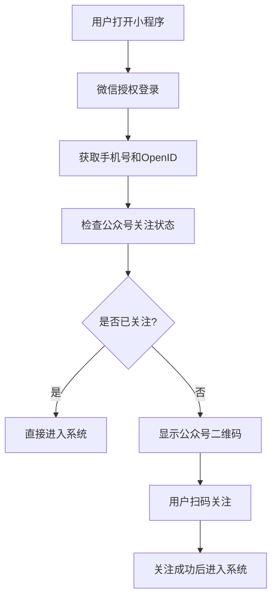

# 小程序登录公众号关注检查功能实现文档

## 📋 需求分析

### 功能描述
实现小程序用户登录后自动检查是否关注了关联的公众号：
- **已关注**: 直接进入系统主页面
- **未关注**: 弹出公众号二维码引导用户关注

### 业务流程


## 🏗️ 系统架构分析

### 当前项目状态
基于代码分析，当前项目已具备以下功能：
1. ✅ **微信小程序授权** - `WeChatAuthController.phoneAuth()`
2. ✅ **公众号关注状态检查** - `WechatMessageService.checkUserSubscription()`
3. ✅ **四层角色判断系统** - 完整的权限管理
4. ✅ **微信API集成** - 完整的微信生态支持

### 需要新增的功能
1. **公众号二维码生成接口**
2. **前端关注状态检查逻辑**
3. **关注引导页面组件**
4. **关注成功后的回调处理**

## 🔧 后端实现方案

### 1. 新增公众号二维码生成接口

#### 1.1 在WeChatAuthController中添加方法
```java
/**
 * 获取公众号关注二维码
 */
@ApiOperation("获取公众号关注二维码")
@GetMapping("/getSubscribeQrCode")
public ResponseEntity<Result> getSubscribeQrCode() {
    Result result = new Result();
    
    try {
        logger.info("📥 接收到获取公众号二维码请求");
        
        // 调用服务生成公众号二维码
        Map<String, Object> qrCodeInfo = wechatMessageService.generateSubscribeQrCode();
        
        result.setData(qrCodeInfo);
        result.setCode("0");
        result.setMsg("获取公众号二维码成功");
        
        logger.info("✅ 公众号二维码生成成功");
        
    } catch (Exception e) {
        logger.error("❌ 获取公众号二维码失败", e);
        result.setCode("1");
        result.setMsg("获取公众号二维码失败: " + e.getMessage());
    }
    
    return ResponseEntity.ok(result);
}
```

#### 1.2 修改phoneAuth方法，增加关注状态检查
```java
// 在现有的phoneAuth方法中，在返回结果前添加：
// 4. 检查公众号关注状态
Map<String, Object> subscriptionInfo = checkSubscriptionStatus(openid);
userInfo.put("subscription", subscriptionInfo);

logger.info("✅ 用户 [{}] 公众号关注状态: {}", 
    phoneNumber, subscriptionInfo.get("isFollowed"));
```

### 2. 扩展WechatMessageService服务

#### 2.1 添加公众号二维码生成方法
```java
/**
 * 生成公众号关注二维码
 */
public Map<String, Object> generateSubscribeQrCode() {
    Map<String, Object> result = new HashMap<>();
    
    try {
        String token = getAccessToken();
        if (StringUtils.isEmpty(token)) {
            throw new RuntimeException("获取AccessToken失败");
        }
        
        // 生成临时二维码（用于统计关注来源）
        String sceneStr = "miniapp_subscribe_" + System.currentTimeMillis();
        String qrCodeUrl = generateTempQrCode(token, sceneStr);
        
        result.put("qrCodeUrl", qrCodeUrl);
        result.put("sceneStr", sceneStr);
        result.put("expireTime", System.currentTimeMillis() + 30 * 24 * 60 * 60 * 1000); // 30天过期
        result.put("tip", "扫描二维码关注公众号，及时接收停车提醒");
        
        return result;
        
    } catch (Exception e) {
        log.error("生成公众号二维码失败", e);
        throw new RuntimeException("生成公众号二维码失败: " + e.getMessage());
    }
}

/**
 * 生成临时二维码
 */
private String generateTempQrCode(String accessToken, String sceneStr) {
    try {
        String url = "https://api.weixin.qq.com/cgi-bin/qrcode/create?access_token=" + accessToken;
        
        Map<String, Object> requestBody = new HashMap<>();
        requestBody.put("expire_seconds", 2592000); // 30天
        requestBody.put("action_name", "QR_STR_SCENE");
        
        Map<String, Object> actionInfo = new HashMap<>();
        Map<String, String> scene = new HashMap<>();
        scene.put("scene_str", sceneStr);
        actionInfo.put("scene", scene);
        requestBody.put("action_info", actionInfo);
        
        String response = HttpClientUtil.doPostJson(url, JSON.toJSONString(requestBody));
        JSONObject jsonResponse = JSON.parseObject(response);
        
        if (jsonResponse.containsKey("ticket")) {
            String ticket = jsonResponse.getString("ticket");
            return "https://mp.weixin.qq.com/cgi-bin/showqrcode?ticket=" + 
                   java.net.URLEncoder.encode(ticket, "UTF-8");
        } else {
            throw new RuntimeException("生成二维码失败: " + response);
        }
        
    } catch (Exception e) {
        log.error("生成临时二维码失败", e);
        throw new RuntimeException("生成临时二维码失败: " + e.getMessage());
    }
}
```

#### 2.2 优化关注状态检查方法
```java
/**
 * 检查用户关注状态并返回详细信息
 */
public Map<String, Object> checkSubscriptionStatus(String openid) {
    Map<String, Object> result = new HashMap<>();
    
    try {
        boolean isFollowed = checkUserSubscription(openid);
        result.put("isFollowed", isFollowed);
        result.put("openid", openid);
        result.put("checkTime", System.currentTimeMillis());
        
        if (!isFollowed) {
            // 如果未关注，同时返回二维码信息
            Map<String, Object> qrCodeInfo = generateSubscribeQrCode();
            result.put("qrCodeInfo", qrCodeInfo);
        }
        
        return result;
        
    } catch (Exception e) {
        log.error("检查关注状态失败", e);
        result.put("isFollowed", false);
        result.put("error", e.getMessage());
        return result;
    }
}
```

### 3. 配置文件更新

#### 3.1 确保微信配置正确
```yaml
# application.yml
wechat:
  # 微信小程序配置
  miniapp:
    appid: wx112d8a922018480e
    secret: c4c0609fbbaf3ecb0a56314cea15f0c8
    token-cache-time: 7000
  
  # 微信公众号配置（必须与小程序关联）
  appid: wx112d8a922018480e  # 如果是同一个主体，可以使用相同AppID
  secret: c4c0609fbbaf3ecb0a56314cea15f0c8
  
  # 公众号二维码配置
  qrcode:
    expire-days: 30  # 二维码有效期（天）
    scene-prefix: "miniapp_subscribe_"  # 场景值前缀
```

## 📱 前端实现方案

### 1. phone-auth.vue页面修改

#### 1.1 数据结构扩展
```javascript
data() {
  return {
    // 现有数据...
    
    // 新增关注相关数据
    subscriptionInfo: {
      isFollowed: false,
      qrCodeInfo: null,
      checkTime: null
    },
    showSubscribeModal: false,  // 是否显示关注引导弹窗
    subscribeQrCode: '',        // 公众号二维码URL
    subscribeChecking: false,   // 是否正在检查关注状态
    autoCheckTimer: null        // 自动检查定时器
  }
}
```

#### 1.2 修改授权成功后的处理逻辑
```javascript
// 在现有的授权成功处理方法中修改
async handleAuthSuccess(authResult) {
  try {
    console.log('📱 授权成功，开始处理用户信息', authResult);
    
    // 保存用户信息
    this.userInfo = authResult.data;
    
    // 检查公众号关注状态
    if (authResult.data.subscription) {
      this.subscriptionInfo = authResult.data.subscription;
      
      if (!this.subscriptionInfo.isFollowed) {
        // 未关注，显示引导弹窗
        this.showSubscribeGuide();
        return; // 暂停进入系统流程
      }
    }
    
    // 已关注或无需检查，直接进入系统
    this.enterSystem();
    
  } catch (error) {
    console.error('❌ 处理授权结果失败:', error);
    this.showError('处理授权结果失败');
  }
}
```

#### 1.3 新增关注引导相关方法
```javascript
methods: {
  /**
   * 显示关注引导弹窗
   */
  showSubscribeGuide() {
    console.log('📢 显示公众号关注引导');
    
    // 设置二维码信息
    if (this.subscriptionInfo.qrCodeInfo) {
      this.subscribeQrCode = this.subscriptionInfo.qrCodeInfo.qrCodeUrl;
    }
    
    // 显示弹窗
    this.showSubscribeModal = true;
    
    // 开始定时检查关注状态
    this.startSubscriptionCheck();
  },
  
  /**
   * 开始定时检查关注状态
   */
  startSubscriptionCheck() {
    // 清除之前的定时器
    if (this.autoCheckTimer) {
      clearInterval(this.autoCheckTimer);
    }
    
    // 每5秒检查一次关注状态
    this.autoCheckTimer = setInterval(async () => {
      await this.checkSubscriptionStatus();
    }, 5000);
  },
  
  /**
   * 检查关注状态
   */
  async checkSubscriptionStatus() {
    if (this.subscribeChecking) return;
    
    try {
      this.subscribeChecking = true;
      
      const response = await uni.request({
        url: `${this.$config.baseUrl}/parking/wechat/checkSubscription`,
        method: 'GET',
        data: {
          openid: this.userInfo.openid
        },
        timeout: 10000
      });
      
      if (response[1].data.code === '0') {
        const isFollowed = response[1].data.data.isFollowed;
        
        if (isFollowed) {
          console.log('✅ 用户已关注公众号');
          this.handleSubscribeSuccess();
        }
      }
      
    } catch (error) {
      console.error('❌ 检查关注状态失败:', error);
    } finally {
      this.subscribeChecking = false;
    }
  },
  
  /**
   * 处理关注成功
   */
  handleSubscribeSuccess() {
    // 停止定时检查
    if (this.autoCheckTimer) {
      clearInterval(this.autoCheckTimer);
      this.autoCheckTimer = null;
    }
    
    // 关闭弹窗
    this.showSubscribeModal = false;
    
    // 显示成功提示
    uni.showToast({
      title: '关注成功！',
      icon: 'success',
      duration: 2000
    });
    
    // 更新关注状态
    this.subscriptionInfo.isFollowed = true;
    
    // 进入系统
    setTimeout(() => {
      this.enterSystem();
    }, 2000);
  },
  
  /**
   * 跳过关注（可选）
   */
  skipSubscribe() {
    uni.showModal({
      title: '提示',
      content: '跳过关注将无法及时接收停车提醒，确定要跳过吗？',
      success: (res) => {
        if (res.confirm) {
          // 停止定时检查
          if (this.autoCheckTimer) {
            clearInterval(this.autoCheckTimer);
            this.autoCheckTimer = null;
          }
          
          // 关闭弹窗
          this.showSubscribeModal = false;
          
          // 进入系统
          this.enterSystem();
        }
      }
    });
  },
  
  /**
   * 进入系统主页面
   */
  enterSystem() {
    console.log('🚀 进入系统主页面');
    
    // 保存用户信息到本地存储
    uni.setStorageSync('userInfo', this.userInfo);
    uni.setStorageSync('subscriptionInfo', this.subscriptionInfo);
    
    // 跳转到主页面
    uni.reLaunch({
      url: '/pages/index/index'
    });
  }
}
```

### 2. 关注引导弹窗模板
```vue
<!-- 在phone-auth.vue的template中添加 -->
<template>
  <!-- 现有内容... -->
  
  <!-- 公众号关注引导弹窗 -->
  <uni-popup ref="subscribePopup" :show="showSubscribeModal" type="center">
    <view class="subscribe-modal">
      <view class="modal-header">
        <text class="modal-title">关注公众号</text>
        <text class="modal-subtitle">及时接收停车提醒</text>
      </view>
      
      <view class="qrcode-container">
        <image 
          :src="subscribeQrCode" 
          class="qrcode-image"
          mode="aspectFit"
          @error="handleQrCodeError"
        />
        <text class="qrcode-tip">请使用微信扫描上方二维码关注公众号</text>
      </view>
      
      <view class="checking-status" v-if="subscribeChecking">
        <uni-icons type="spinner-cycle" class="loading-icon"></uni-icons>
        <text>正在检查关注状态...</text>
      </view>
      
      <view class="modal-actions">
        <button class="skip-btn" @click="skipSubscribe">暂时跳过</button>
        <button class="refresh-btn" @click="checkSubscriptionStatus">手动检查</button>
      </view>
    </view>
  </uni-popup>
</template>
```

### 3. 样式定义
```scss
<style lang="scss" scoped>
.subscribe-modal {
  width: 600rpx;
  background: white;
  border-radius: 20rpx;
  padding: 40rpx;
  text-align: center;
  
  .modal-header {
    margin-bottom: 40rpx;
    
    .modal-title {
      font-size: 36rpx;
      font-weight: bold;
      color: #333;
      display: block;
      margin-bottom: 10rpx;
    }
    
    .modal-subtitle {
      font-size: 28rpx;
      color: #666;
    }
  }
  
  .qrcode-container {
    margin-bottom: 40rpx;
    
    .qrcode-image {
      width: 400rpx;
      height: 400rpx;
      border: 2rpx solid #eee;
      border-radius: 10rpx;
      margin-bottom: 20rpx;
    }
    
    .qrcode-tip {
      font-size: 24rpx;
      color: #999;
      line-height: 1.5;
    }
  }
  
  .checking-status {
    display: flex;
    align-items: center;
    justify-content: center;
    margin-bottom: 30rpx;
    color: #007aff;
    font-size: 28rpx;
    
    .loading-icon {
      margin-right: 10rpx;
      animation: rotate 1s linear infinite;
    }
  }
  
  .modal-actions {
    display: flex;
    gap: 20rpx;
    
    button {
      flex: 1;
      height: 80rpx;
      border-radius: 40rpx;
      font-size: 28rpx;
      border: none;
    }
    
    .skip-btn {
      background: #f5f5f5;
      color: #666;
    }
    
    .refresh-btn {
      background: #007aff;
      color: white;
    }
  }
}

@keyframes rotate {
  from { transform: rotate(0deg); }
  to { transform: rotate(360deg); }
}
</style>
```

## 🔄 API接口更新

### 1. 新增接口路由
在现有的API配置中添加：
```javascript
// config/api.js
export const apiUrls = {
  // 现有配置...
  
  wechat: {
    // 现有配置...
    getSubscribeQrCode: '/parking/wechat/getSubscribeQrCode',
    checkSubscription: '/parking/wechat/checkSubscription'
  }
}

// 新增API方法
export const wechatAPI = {
  // 现有方法...
  
  // 获取公众号关注二维码
  getSubscribeQrCode() {
    return request({
      url: apiUrls.wechat.getSubscribeQrCode,
      method: 'GET',
      timeout: 30000
    });
  },
  
  // 检查关注状态
  checkSubscription(params) {
    return request({
      url: apiUrls.wechat.checkSubscription,
      method: 'GET',
      data: params,
      timeout: 10000
    });
  }
}
```

## 🧪 测试方案

### 1. 后端接口测试
```bash
# 1. 测试获取公众号二维码
curl -X GET "http://www.xuerparking.cn:8543/parking/wechat/getSubscribeQrCode"

# 2. 测试检查关注状态
curl -X GET "http://www.xuerparking.cn:8543/parking/wechat/checkSubscription?openid=test_openid"
```

### 2. 前端功能测试
1. **正常流程测试**
   - 用户首次登录 → 显示关注引导
   - 用户扫码关注 → 自动检测到关注 → 进入系统

2. **异常情况测试**
   - 网络异常时的处理
   - 二维码加载失败的处理
   - 用户选择跳过关注的处理

### 3. 集成测试
1. **微信环境测试**
   - 在真实微信环境中测试
   - 验证公众号和小程序的关联关系

2. **多用户场景测试**
   - 已关注用户的快速登录
   - 未关注用户的引导流程

## 📋 部署清单

### 1. 后端部署
- [ ] 更新WeChatAuthController
- [ ] 扩展WechatMessageService
- [ ] 验证微信配置
- [ ] 测试API接口

### 2. 前端部署
- [ ] 修改phone-auth.vue页面
- [ ] 添加关注引导组件
- [ ] 更新API配置
- [ ] 测试用户流程

### 3. 微信配置
- [ ] 确认公众号和小程序关联
- [ ] 配置服务器域名白名单
- [ ] 测试微信API调用

## ⚠️ 注意事项

### 1. 微信生态限制
- 公众号和小程序必须是同一主体或关联主体
- 需要在微信公众平台配置服务器域名
- 关注状态检查有频率限制

### 2. 用户体验考虑
- 提供跳过关注的选项
- 关注检查不应阻塞用户正常使用
- 二维码加载失败时的降级方案

### 3. 性能优化
- 关注状态检查使用缓存
- 二维码生成结果缓存
- 避免频繁的API调用

---

## 📞 技术支持

如有问题，请检查：
1. 微信配置是否正确
2. 公众号和小程序是否关联
3. 服务器域名是否在白名单中
4. API接口是否正常响应

*文档版本: v1.0 | 更新时间: 2025年7月9日*
