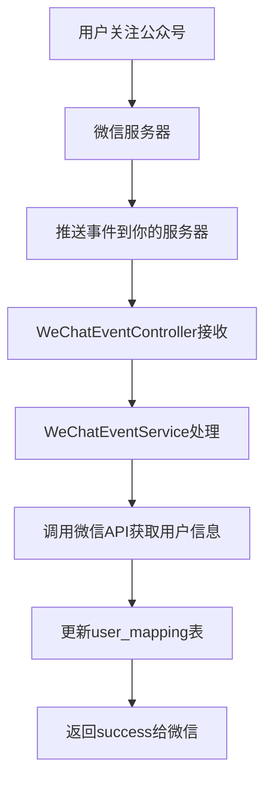

# 🚀 微信事件推送实时更新用户映射表方案

## 📋 方案概述

通过微信公众号事件推送机制，实现用户关注/取消关注时的**实时同步**，自动更新`user_mapping`表中的用户信息。

## 🏗 架构流程



## 🔧 实施步骤

### 1. 数据库更新

执行SQL脚本更新表结构：
```bash
mysql -u username -p database_name < database/user_mapping_update.sql
```

### 2. 微信公众号后台配置

登录微信公众号管理后台：

1. **基本配置**
   - 服务器地址(URL): `https://yourdomain.com/wechat/event`
   - Token: `your_wechat_token_here` (在代码中配置相同值)
   - 消息加解密方式: 明文模式 (推荐) 或兼容模式

2. **启用服务器配置**
   - 点击"启用"按钮
   - 微信会发送验证请求到你的服务器

### 3. 配置文件更新

在`application.yml`中添加/确认配置：

```yaml
wechat:
  appId: your_app_id_here
  secret: your_app_secret_here
```

### 4. 更新WeChatEventController中的Token

```java
// 在WeChatEventController.java中更新
private static final String WECHAT_TOKEN = "your_actual_token_here";
```

## 📡 事件推送数据格式

### 关注/取消关注事件（根据官方文档）

用户关注时，微信推送的XML数据示例：
```xml
<xml>
  <ToUserName><![CDATA[公众号原始ID]]></ToUserName>
  <FromUserName><![CDATA[用户openid]]></FromUserName>
  <CreateTime>事件时间戳</CreateTime>
  <MsgType><![CDATA[event]]></MsgType>
  <Event><![CDATA[subscribe]]></Event>
</xml>
```

### 扫描带参数二维码事件

**用户未关注时**，进行关注后推送：
```xml
<xml>
  <ToUserName><![CDATA[公众号原始ID]]></ToUserName>
  <FromUserName><![CDATA[用户openid]]></FromUserName>
  <CreateTime>事件时间戳</CreateTime>
  <MsgType><![CDATA[event]]></MsgType>
  <Event><![CDATA[subscribe]]></Event>
  <EventKey><![CDATA[qrscene_123123]]></EventKey>
  <Ticket><![CDATA[TICKET]]></Ticket>
</xml>
```

**用户已关注时**，扫描推送：
```xml
<xml>
  <ToUserName><![CDATA[公众号原始ID]]></ToUserName>
  <FromUserName><![CDATA[用户openid]]></FromUserName>
  <CreateTime>事件时间戳</CreateTime>
  <MsgType><![CDATA[event]]></MsgType>
  <Event><![CDATA[SCAN]]></Event>
  <EventKey><![CDATA[SCENE_VALUE]]></EventKey>
  <Ticket><![CDATA[TICKET]]></Ticket>
</xml>
```

### 上报地理位置事件
```xml
<xml>
  <ToUserName><![CDATA[公众号原始ID]]></ToUserName>
  <FromUserName><![CDATA[用户openid]]></FromUserName>
  <CreateTime>事件时间戳</CreateTime>
  <MsgType><![CDATA[event]]></MsgType>
  <Event><![CDATA[LOCATION]]></Event>
  <Latitude>23.137466</Latitude>
  <Longitude>113.352425</Longitude>
  <Precision>119.385040</Precision>
</xml>
```

## 🎯 核心功能特性

### ✅ 实时更新
- **秒级响应**：用户关注后立即更新数据库
- **自动同步**：无需手动干预或定时任务

### ✅ 完整用户信息
自动获取并保存：
- 基本信息：昵称、头像、性别
- 地理信息：城市、省份、国家  
- 关注状态：关注时间、取消关注时间

### ✅ 可靠性保证
- **签名验证**：确保请求来自微信服务器
- **异常处理**：API调用失败时的重试机制
- **日志记录**：详细的操作日志便于排查问题

## 🔍 测试验证

### 1. 手动测试
- 关注公众号，查看日志输出
- 检查`user_mapping`表是否新增记录
- 取消关注，验证状态更新

### 2. 日志监控
关键日志信息：
```
✅ 微信服务器验证成功
📥 收到微信事件推送  
👋 处理用户关注事件
✅ 创建新用户记录 - openId: xxx, 昵称: xxx
```

### 3. 数据库验证
```sql
-- 查看最新关注的用户
SELECT openid, nickname, is_followed, follow_time 
FROM user_mapping 
WHERE is_followed = 1 
ORDER BY follow_time DESC 
LIMIT 10;
```

## ⚠️ 注意事项

### 📡 微信服务器响应要求（重要）
- **5秒响应限制**：微信服务器在五秒内收不到响应会断掉连接，并且重新发起请求，总共重试三次
- **消息排重**：推荐使用FromUserName + CreateTime排重，避免重复处理
- **异常处理**：如果服务器无法保证在五秒内处理并回复，可以直接回复空串，微信服务器不会对此作任何处理，并且不会发起重试
- **隐私保护**：为保护用户数据隐私，开发者收到用户取消关注事件时需要删除该用户的所有信息

### 网络配置
- 确保服务器能被微信服务器访问（公网IP或域名）
- 建议使用HTTPS（微信推荐）

### 安全配置  
- Token要足够复杂，避免被猜测
- 验证签名确保请求来源的真实性

### 异常处理
- 微信API调用失败时会记录错误日志
- 可以通过日志排查问题并手动补充数据
- 使用异步处理确保及时响应微信服务器

## 🚀 优势对比

| 方案 | 实时性 | 准确性 | 资源消耗 | 实施难度 |
|------|--------|--------|----------|----------|
| **事件推送** | ⭐⭐⭐⭐⭐ | ⭐⭐⭐⭐⭐ | ⭐⭐⭐⭐⭐ | ⭐⭐⭐ |
| 定时任务 | ⭐⭐⭐ | ⭐⭐⭐⭐ | ⭐⭐⭐ | ⭐⭐⭐⭐ |
| 手动同步 | ⭐ | ⭐⭐ | ⭐⭐⭐⭐⭐ | ⭐⭐⭐⭐⭐ |

## 📞 技术支持

遇到问题时的排查步骤：
1. 检查微信后台配置是否正确
2. 查看应用日志中的错误信息  
3. 验证网络连通性和SSL证书
4. 确认Token配置是否一致
5. 检查响应时间是否超过5秒限制
6. 确认异步线程池配置是否正常

## 📚 参考文档

- [微信官方事件推送文档](https://developers.weixin.qq.com/doc/service/guide/product/message/Receiving_event_pushes.html)
- 本实现严格遵循微信官方规范，包括：
  - 5秒响应时间限制
  - FromUserName + CreateTime消息排重
  - 取消关注时的隐私保护要求
  - 支持所有官方定义的事件类型 